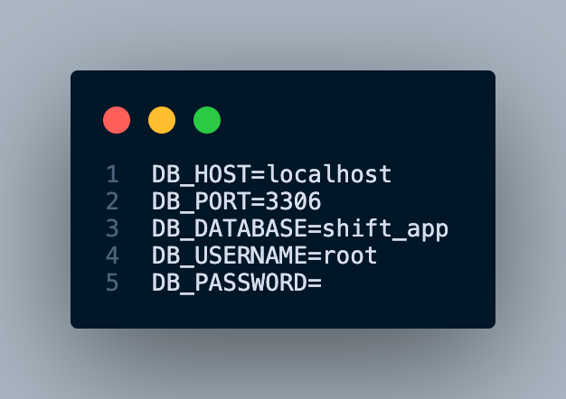
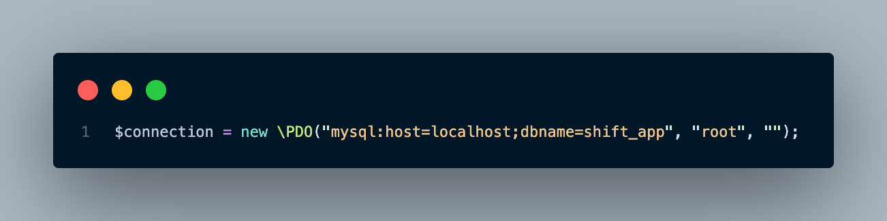
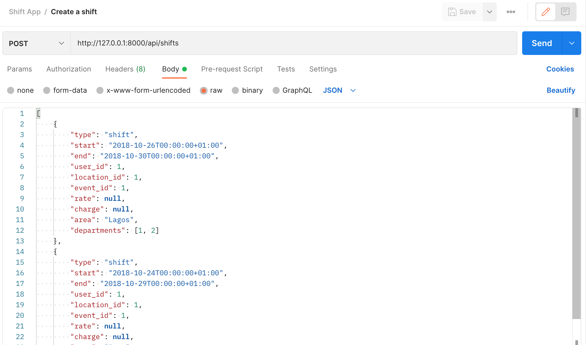
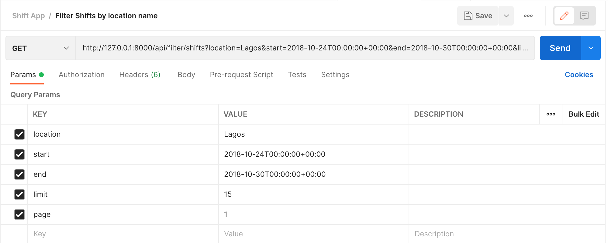

# shifts-api-app

Please fork this repo to your own github account, then `git clone` it
locally.

You'll need to create a .env file, this will contain database credentials like this.

The exported database file is in the db directory in the project root directory.

You can also run `php dbseed.php` at the project root in the command to generate dummy data into your database. (Make sure the dbname is updated to your database name)

Run `php -S 127.0.0.1:8000` to serve the project

# API Endpoints

Here is a link to the postman documentation:
https://documenter.getpostman.com/view/616819/UzQvrPqb

### Create many shifts with relations

- URL: http://127.0.0.1:8000/api/shifts
- Request Method: POST
- Data: Array of shift data input
- Optional data: limit, and page.
- Sample data:
  

### Delete all data stored in app

- URL: http://127.0.0.1:8000/api/delete/app-data
- Request Method: GET

### Filter Shifts by location name and between 2 dates

- URL: http://127.0.0.1:8000/api/filter/shifts
- Request Method: GET
- Data: location, start, and end.
- Optional data: limit, and page.
- Sample data:
  

### Answer to number (4)

I implemeted pagination to the GET requests `Getting all shifts and Getting Shifts for a location between 2 dates`
`(The response data is set to 10 by default)`.
A `next` and `previous` key is added to the response data for large data (more than limit).

This prevents the app from crashing or causing a hang on the frontend/app coonsuming the api. So the pagination helps limit the amount data gotten per request.
This is my solution for the number (4) question in the test.
